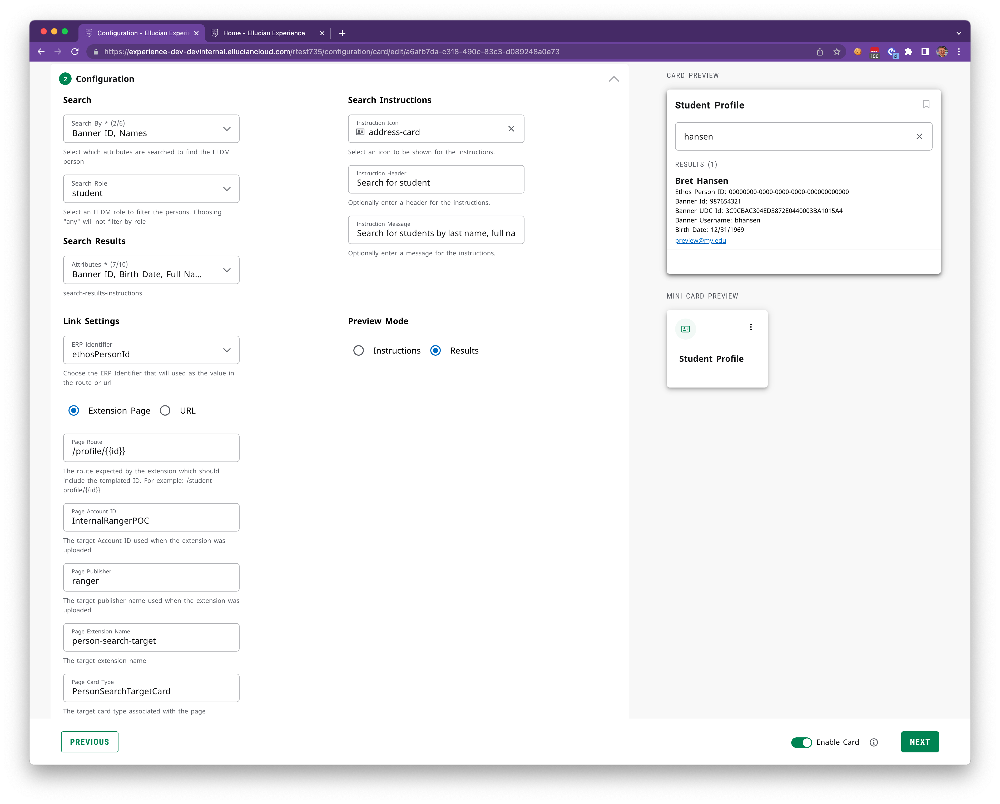

# Experience Person Search

This repository contains an Experience Person Search extension and a microservice. The extension defines a single card. The PersonSearch card is an Experience "template" card. Each instance of the card is configured individually, allowing for the creation of person search cards targeted at different populations within the ERP.

The PersonSearch card includes a Search Path component that enables end-users to search for persons using names or IDs. Upon entering a search query, the card makes a single query request to the microservice, which issues one or more Ethos get requests with criteria based on the configuration to search for persons.

This repository also includes an example page that provides a starting point for building another extension that can be launched via the PersonSearch card. This extension page is included as an example to illustrate that any extension's page can be targeted by the PersonSearch card.

The microservice provided in this repository is implemented using AWS Lambda and exposes an */api/person-search* endpoint. When a query parameter searchString is passed, the microservice retrieves the server-side card configuration to build one or more get request criteria. It issues these queries in parallel, waits for all the responses, combines and sorts them, and returns only the Ethos persons attributes that will be displayed, ensuring that no more data than necessary is sent.

More information about the extension and the microservice can be found in their respective README files located in the [extension](extension/README.md) and [microservice](microservice/README.md) directories.

Below are views of the card and the card configuration
 
 

  
  

  

 

Copyright 2021–2023 Ellucian Company L.P. and its affiliates.

  
