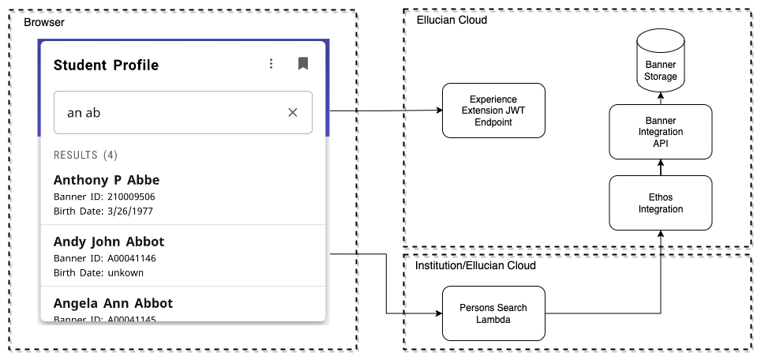

# Person Search Extension

This extension includes the primary artifact card. An example target page is included as the person-search-target directory and it is uploaded separately if needed. The PersonSearch card is an Experience "template" card. Each instance of the card is configured individually, allowing for the creation of person search cards targeted at different populations within the ERP.

The interaction between the Experience card with Ethos is as diagramed.

<br/>
<div style="display: flex; justify-content: center">
  
</div>
<br/>

## Upload the extension

To upload and use this extension, you will need to do the following from the ```extension``` directory:

(Note): the microservice must be set up and running before uploading the extension. The extension needs the URL of the microservice. See the [microservice](../microservice/README.md) readme.

* Run `npm install`
* Set the "publisher" in extension.js. The Publisher should be the name of your institution or organization.
* Copy sample.env to .env. Adding your upload token and uncommenting and editing the other vars as appropriate.
* You will need to configure the URL to the Person Search microservice in the .env file as the value to ```SERVICE_URL```
* Run one of the deploy scripts in package.json. Such as *watch-and-upload* or *deploy-dev*.
* Use Experience Setup to enable or verify your new extension is enabled, is associated with an Environment, has a shared secret, and has an Extension API Token.

## Upload the person search target page's extension

This extension is merely to illustrate the process of using the Person Search card to launch another extension's page.

To upload and use this extension, you will need to do the following from the ```person-search-target``` directory:

* Run `npm install`
* Set the "publisher" in extension.js. The Publisher should be the name of your institution or organization.
* Copy sample.env to .env. Adding your upload token and uncommenting and editing the other vars as appropriate.
* Run one of the deploy scripts in package.json. Such as *watch-and-upload* or *deploy-dev*.
* Use Experience Setup to enable or verify your new extension is enabled and is associated with an Environment.

## Create a card and configure

Follow this sequence of steps to create and configure a Person Search template card which will launch the provided example Person Search Target's page.

1. Navigate to Experience -> Configuration.
1. In Card Management, click on the ADD CARD button.
1. Select the Card Template named Person Search.
1. Fill in a Card title - for example, Student Profile.
1. Add a Card description.
1. Add a Card tag or two.
1. Expand the Configuration section.
1. In the Search By, pick one or more attributes to use in the search - for example, *Names*.
1. In the Search Role, pick an EEDM role or ```any``` - for example, student.
1. In the Search Results, pick at least a name type attribute - for example, Full Name, Banner ID, and Birth Date.
1. In the Erp identifier, pick the ID type that will be passed to the Page or URL. For EEDM data retrieval, use ethosPersonId. For Banner Business Process API data retrieval, use bannerId.
1. Select either Extension Page or URL for the Link type - for example, use Extension Page (default)
1. In the Page Route, enter the route as required by the target page. In the PersonSearchTarget page example, see the route as defined in ```person-search-target/src/page/index.jsx```. The Route in this example page is ```/profile/{{id}}```. Note that the selected ERP Identifier will be substituted for the mustache like {{id}} in the route.
1. In the Page Account ID, you will need to enter your Account ID as known by Experience. You can find this by using card configuration to configure the Person Search Target Card, viewing it in the Experience Dashboard, and clicking on it. You will find the URL for the page that launches to include all of these Page targeting details. The URL will end with something like ```/page/001G000000oSgE6IAK/ranger/person-search-target/PersonSearchTargetCard/profile/1```. The value right after ```/page/``` is your Account ID.
1. In the Page Publisher, enter the value of the publisher as defined in the extension.js for the target extension.
1. In the Page Extension Name, enter the extension name as defined in the extension.js. For example, person-search-target.
1. In the Page Card Type, enter the name of the target card as defined in the extension.js. For example, PersonSearchTargetCard
1. Alternatively, you can configure a URL to be launched by selecting a Link Type of URL
1. For a Link URL, switch the Open in new tab to on or off.
1. For a Link URL, enter a URL and include the mustache ID replacement in the URL as needed - ```{{id}}```
1. Fill out the Search Instructions as desired
1. Note you can toggle between a Preview Mode of Instructions and Results to see a preview of both modes.
1. Finally, expand the Roles section and select the desired roles for targeting the card

<br/>
<div style="display: flex; justify-content: center">
Copyright 2021–2023 Ellucian Company L.P. and its affiliates.
</div>
